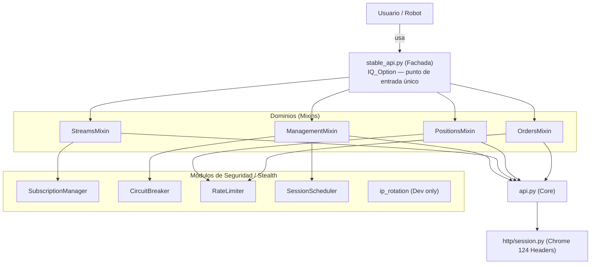

# Arquitectura del SDK (v8.9.995)

## Diagrama de Capas

## Módulos del SDK

| Módulo | Propósito | Entorno | Integrado en |
| :--- | :--- | :--- | :--- |
| `stable_api.py` | Fachada pública del SDK | Ambos | Punto de entrada |
| `api.py` | Motor WS/HTTP (protocolo base) | Ambos | `stable_api.py` |
| `mixins/orders_mixin` | Órdenes Binary/Digital/CFD | Ambos | `stable_api.py` |
| `mixins/positions_mixin` | Cierre y monitoreo de posiciones | Ambos | `stable_api.py` |
| `mixins/streams_mixin` | Suscripciones de mercado (velas) | Ambos | `stable_api.py` |
| `mixins/management_mixin` | Conexión, reconexión, metadata | Ambos | `stable_api.py` |
| `subscription_manager` | Límite de 15 streams simultáneos | Ambos | `streams_mixin` |
| `circuit_breaker` | Protección ante baneos/429/403 | Ambos | `management_mixin` |
| `session_scheduler` | Delays humanizados entre sesiones | Ambos | `management_mixin` |
| `ip_rotation` | Rotación IP vía WARP | Dev only | `connect_with_rotation` |
| `core/ratelimit.py` | Token bucket para ráfagas de órdenes | Ambos | `orders/positions` |
| `http/session.py` | Headers Chrome 124 y TLS | Ambos | `api.py` |
